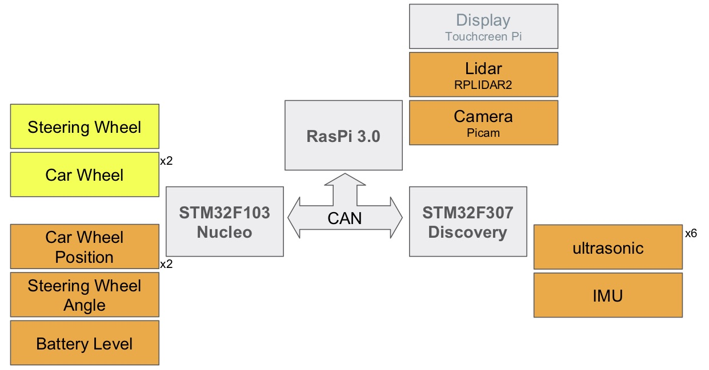

# Overview of the hardware architecture

## Electronic control units

The **GeiCar** is composed of three Electronic control units interconnected by a CAN network. The calculators are:

* Raspberry Pi 3.0 ([link](http://fr.farnell.com/raspberry-pi/rpi3-modb-16gb-noobs/sbc-raspberry-pi3-mod-b-16gb-sd/dp/2525227?ICID=I-HP-SO-RASP-MICROSD-NOOB))
* Nucleo STM32F103RB ([link](https://www.st.com/en/evaluation-tools/nucleo-f103rb.html))
* Discovery STM32F3 ([link](https://www.st.com/en/evaluation-tools/stm32f3discovery.html))

## Networks

The ECUs communicate through a CAN network. This is natively provided on the STM32 cards, but requires an additional card for the Raspberry Pi. The chosen card is a **PICAN 2** from [CopperhilTech](https://copperhilltech.com/pican-2-can-interface-for-raspberry-pi-2-3/).

The **GeiCar** can communicate with external components via Bluetooth or WiFi support through the Raspberry Pi.

## Sensors and actuators

As shown below, the GeiCar has several sensors and actuators connected to the various ECUs.

### Sensors

| Name                  | Connected to    | Number | Reference |
|:----------------------|:---------------:| :-----:|:--------- |
| Wheel coder           | Nucleo          | 2      |           |
| Steering wheel	angle  | Nucleo          | 1      |
| Battery level         | Nucleo          | 1      |
| Steering manual control| Nucleo          | 2      |           |
| Power Switch          | Nucleo          | 1      |           |
| Lidar                 | Raspeberry Pi   | 1      | [RPLIDAR A2](https://www.robotshop.com/eu/fr/scanner-laser-360-rplidar-a2m8.html)|
| Camera                | Raspeberry Pi   | 1      | [RPI 8MP](http://fr.farnell.com/raspberry-pi/rpi-8mp-camera-board/raspberry-pi-camera-board-v2/dp/2510728) |
| Ultrasonic sensor     | Discovery       | 6      |  |
| IMU Gyroscope         | Discovery       | 1      | [L3GD20](https://www.st.com/en/evaluation-tools/stm32f3discovery.html) |
| IMU linear acceleration | Discovery       | 1      | [LSM303DLHC](https://www.st.com/en/evaluation-tools/stm32f3discovery.html) |

A **touch screen** is connected to the Raspberry Pi, but its use is to be limited because its power consumption and in terms of computing resources is important. It is better to transfer all graphical user interfaces to a PC or smartphone.

### Actuators

| Name                  | Connected to    | Number |
|:----------------------|:---------------:| :-----:|
| Steering wheel motor  | Nucleo          | 1      |
| Car wheel motor       | Nucleo          | 2      |
