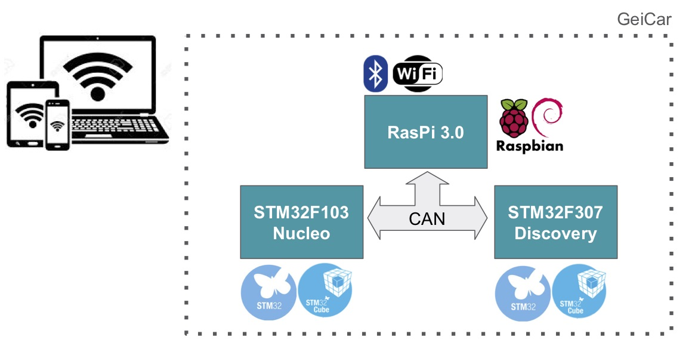

# CAN Bus

## Overview
The CAN network provides communication between the various ECUs in the system. The code available is based on a set of pre-defined messages with their own identifier and payload.

The CAN bus is configured with a **bitrate of 400 Kbit/s**.

## CAN Configuration for STM32

**Clock Tree:** APB1 frequency = 24 MHz

**CAN configuration with CubeMX:**

* Prescaler = 6 (for 4MhZ)
* Time quantum (tq): tq = 1 / (f_APB1/prescaler) =  250 ns
* Bit Segment 1 (BS1) = 7 tq
* Bit Segment 2 (BS2) = 2 tq
* Synchronization Jump Width (SJW) = 1 tq

baudrate = 1 / [tq * (SJW + BS1 + BS2) ]  = 400 kBits/s

## How to Use the PICAN 2
On the Raspberry Pi the CAN uses the shield **PICAN 2**. This shield is designed by **CopperhillTech**. The procedure to configure the PICAN 2 on a Raspbian is explained on the website of [CopperhillTech](https://copperhilltech.com/pican2-controller-area-network-can-interface-for-raspberry-pi/). Samples of C and python code are available on the web site as well as a set of programs to test the configuration. For example, the traffic on `can0` can be monitored with:

~~~~
./candump can0
~~~~

Main steps to config the Raspbian are :

* Edit the file `/boot/config.txt` by:

~~~~
sudo nano /boot/config.txt
~~~~

* Add these 3 lines to the end of file:

~~~~
dtparam=spi=on
dtoverlay=mcp2515-can0,oscillator=16000000,interrupt=25
dtoverlay=spi-bcm2835-overlay
~~~~

* Reboot the Raspberry Pi:

~~~~
sudo reboot
~~~~

* Initialize the CAN interface by entering:

~~~~
sudo /sbin/ip link set can0 up type can bitrate 400000
~~~~

## Description of the CAN Messages

### Control Motor Commands (CMC)

* **From:** Raspeberry
* **To:** Nucleo
* **Lenght (Bytes):** 3
* **Data field:**

|Byte 0 |Byte 1 | Byte 2|
|:------|:------|:------|
|PWMG_cons | PWMGD_cons | PWMAV_cons |

* **PWMG\_cons: Left motor command**
	* Bit 7: Enable bit.
		This bit is used to deactivate the left motor drivers in order to avoid power consumption and save batteries.
		* 0: motor disable
		* 1: motor enable	
	* Bits 6-0: command bits.
		This bit-field is used to control the speed of the left motor. The value 0 is the maximum speed backwards. The value 50 stops the motor. The value 100 is the maximum value forward.
		* value between 0 and 100.

		*Note:* To avoid power problem, the PWM that controls the motor is limited to 40%.

* **PWMD\_cons: Right motor command**
	* Bit 7: Enable bit.
		This bit is used to deactivate the right motor drivers in order to avoid power consumption and save batteries.
		* 0: motor disable
		* 1: motor enable
	* Bits 6-0: command bits.
		This bit-field is used to control the speed of the right motor. The value 0 is the maximum speed backwards. The value 50 stops the motor. The value 100 is the maximum value forward.
		* value between 0 and 100.

		_Note:_ To avoid power problem, the PWM that controls the motor is limited to 60%.

* **PWMAV\_cons: Steering wheel motor command**
	* Bit 7: Enable bit.
		This bit is used to deactivate the steering motor drivers in order to avoid power consumption and save batteries.
		* 0: motor disable
		* 1: motor enable
	* Bits 6-0: command bits.
		This bit-field is used to control the steering  motor. The value 0 turns the wheel to the left with the maximum speed. The value 50 stops the motor. The value 100 turns the wheel to the right with the maximum speed.
		* value between 0 and 100.

		_Note:_ To avoid power problem, the PWM that controls the motor is limited to 40%.

### Motor Sensors (MS)

* **From:** Nucleo
* **To:** Raspeberry
* **Lenght (Bytes):** 8
* **Data field:**

|Bytes 0-1 |Bytes 2-3| Bytes 4-5| Bytes 6-7 |
|:------|:------|:------|:------|
|Vol_mes | Bat_mes | VMG_mes | VMD_mes |

* **Vol\_mes: Steering Wheel Angle**
	* Bits 15-0: Raw data from the angle sensor on the steering wheel.
* **Bat\_mes: Battery Level**	
	* Bits 15-0: Raw data from the battery sensor. The value is between 0 and 0xFFF. The battery level U (V) can be computed by U = (4095 / Bat\_mes) * (3.3 / 0.2). The nominal operation of the battery has to be between 11 and 14 V. 
* **VMG\_mes: Left Motor Speed**	
	* Bits 15-0: The speed of the left rear motor in *0.01 rpm. The direction of rotation of the motor must be deduced from the command.
* **VMD\_mes: Right Motor Speed**	
	* Bits 15-0: The speed of the right rear motor in *0.01 rpm. The direction of rotation of the motor must be deduced from the command.

### Ultrasonic Sensors 1 (US1)

* **From:** Discovery
* **To:** Raspeberry
* **Lenght (Bytes):** 6
* **Data field:**

|Bytes 0-1 |Bytes 2-3| Bytes 4-5|
|:------|:------|:------|
|US_AVG | US_AVD | US_ARC|

* **US_AVG: Front Left Ultrasonic**
	* bits 15-0: distance in cm measured by the front left ultrasonic sensor.
* **US_AVD: Front Right Ultrasonic**
	* bits 15-0: distance in cm measured by the front right ultrasonic sensor.
* **US_ARC: Central Rear Ultrasonic**
	* bits 15-0: distance in cm measured by the central rear ultrasonic sensor.

### Ultrasonic Sensors 2 (US2)

* **From:** Discovery
* **To:** Raspeberry
* **Lenght (Bytes):** 6
* **Data field:**

|Bytes 0-1 |Bytes 2-3| Bytes 4-5|
|:------|:------|:------|
|US_ARG | US_ARD | US_AVC|

* **US_ARG: Left Rear Ultrasonic**
	* bits 15-0: distance in cm measured by the left rear ultrasonic sensor.
* **US_ARD: Right Rear Ultrasonic**
	* bits 15-0: distance in cm measured by the right rear ultrasonic sensor.
* **US_AVC: Central Front Ultrasonic**
	* bits 15-0: distance in cm measured by the central front ultrasonic sensor.

### Orientation Measures 1 (OM1)

* **From:** Discovery
* **To:** Raspeberry
* **Lenght (Bytes):** 8
* **Data field:**

|Bytes 0-3 |Bytes 4-7|
|:------|:------|
|Yaw | Pitch |

* **Yaw: Yaw Angle**
	* bits 31-0: value in float of the yaw angle in degree.
* **Pitch: Pitch Angle**
	* bits 31-0: value in float of the pitch angle in degree.

### Orientation Measures 2 (OM2)
* **From:** Discovery
* **To:** Raspeberry
* **Lenght (Bytes):** 4
* **Data field:**

|Bytes 0-3 |
|:------|
|Roll |

* **Roll: Roll Angle**
	* bits 31-0: value in float of the roll angle in degree.

## IDs of the CAN Messages

|Name                        |Class ID |SubClass ID|Priority |ID    |
|----------------------------|:-------:|:---------:|:-------:|:----:|
|                            |3bits    |4bits      |4bits    |11bits|
|Control Motor Commands (CMC)|0x0      |0x1        |0x0      |0x010 |
|Motor Sensors (MS)          |0x1      |0x0        |0x0      |0x100 |
|Ultrasonic Sensors 1 (US1)  |0x0      |0x0        |0x0      |0x000 |
|Ultrasonic Sensors 2 (US2)  |0x0      |0x0        |0x1      |0x001 |
|Orientation Measures 1 (OM1)|0x1      |0x0        |0x1      |0x101 |
|Orientation Measures 2 (OM2)|0x1      |0x0        |0x2      |0x102 |
