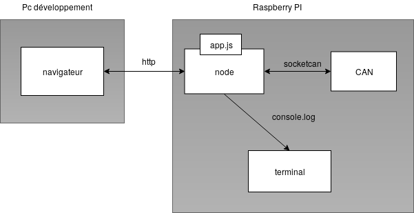

# User guide GeiCar UI with nodejs

This code is an example of a nodejs server to provide an UI for the GeiCar. The code was written by Lucien Senaneuch and is available on [github](https://github.com/daihitsuji/UI-CAR).

:warning: **This code was produced for an older version of the CAN messages. The project is not functional with the current messages..**

## What is nodejs

Node.js is an open-source, cross-platform JavaScript run-time environment that executes JavaScript code outside of a browser. Node.js allows the creation of Web servers and networking tools using JavaScript and a collection of "modules" that handle various core functionality.

Turorials and documentation are procvided on the [official site](https://nodejs.org/).

## Install nodejs
Install nodejs on the Raspberry Pi ;

```
curl -sL https://deb.nodesource.com/setup_8.x | sudo -E bash -
sudo apt-get install -y nodejs
node -v
```

## Initialize the CAN interface

Initialize the CAN interface according to the instructions in :

[https://copperhilltech.com/pican2-controller-area-network-can-interface-for-raspberry-pi/](https://copperhilltech.com/pican2-controller-area-network-can-interface-for-raspberry-pi/)

The communication between the nodejs server and the CAN bus is established on **can0**.

# Platform architecture

The software architecture is shown below. 



The nodejs server is run on the Raspberry Pi while the graphical monitoring interface is running on a remote PC. 

The communication between the graphical interface and the nodejs server is done via the WiFi. Communication between the CAN bus and app.js is provided by the socketcan extension of nodejs.

# Running and installing the nodejs server

On the Raspberry, retrieve the module code on github by running the command

```
git clone https://github.com/pehladik/geicar
```
Go to the repository `/geicar/raspberry/nodejs` then install the dependencies by running the command :

```
npm install -save
```
To run the nodejs

```
node app.js
```
or just 

```
./app.js
```

# Connection to the nodejs server

Launch a browser on a PC and indicate the address of the raspberry on port 3000 in the address bar, for example 10.105.1.2:3000. 

The interface then receives and displays the information from the car. It is also possible to launch orders to control the application by clicking on the different buttons.

